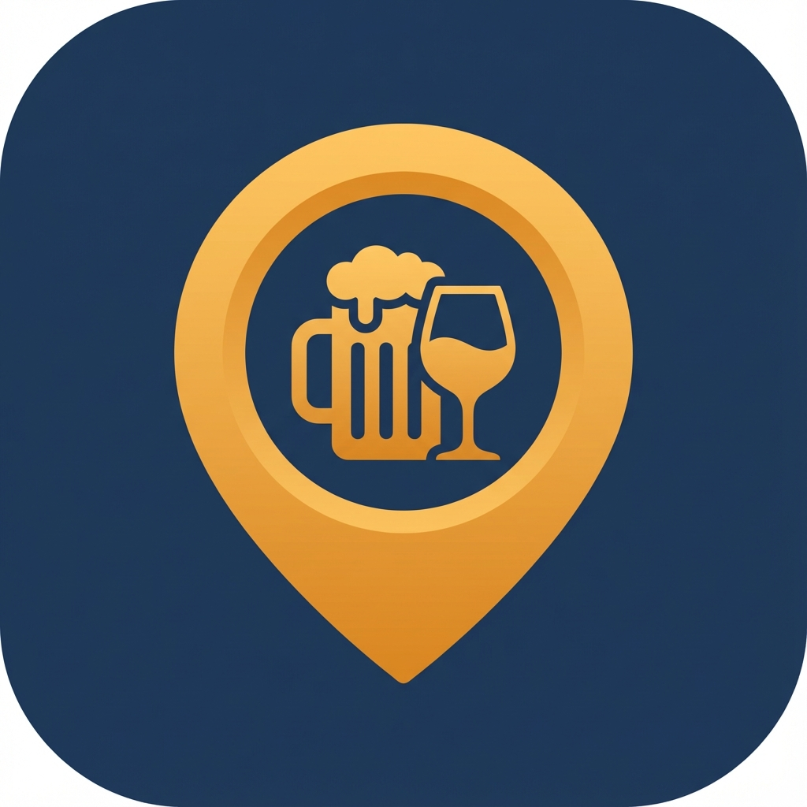

# TourBar - Aplicación Flutter

<p align="center">
  
</p>

Aplicación móvil para descubrir bares, ver menús y promociones. Desarrollada con Flutter y Riverpod.

## 📱 Características

### Para Clientes
- 🔍 **Búsqueda de bares** por nombre, ciudad o dirección
- 📍 **Lista de bares** con fotos, ubicación y valoraciones
- 🍺 **Ver menús** completos con categorías y precios
- 🎉 **Promociones** con descuentos y fechas de validez
- ⭐ **Reseñas y Calificaciones** ver opiniones y calificar bares
- ❤️ **Favoritos** (próximamente)

### Para Propietarios (Owners)
- 🏪 **Gestionar bares** propios (CRUD)
- 📋 **Crear menús** con categorías e items
- 🎁 **Crear promociones** con fechas y descuentos
- 💬 **Gestionar reseñas** ver y responder opiniones
- 📸 **Subir fotos** de bares y promociones

## 🛠️ Tecnologías

| Categoría | Tecnología |
|-----------|------------|
| Framework | Flutter 3.13+ |
| Estado | Riverpod |
| Navegación | GoRouter |
| HTTP | Dio |
| Storage | Flutter Secure Storage |
| Diseño | Material Design 3 |

## 🚀 Instalación

```bash
# Clonar repositorio
git clone https://github.com/walter10x/mono-bars.git
cd mono-bars/front-bars-flutter

# Instalar dependencias
flutter pub get

# Generar código
dart run build_runner build --delete-conflicting-outputs

# Ejecutar app
flutter run
```

## ⚙️ Configuración

Editar `lib/core/constants/app_constants.dart`:

```dart
static const String baseUrl = 'http://192.168.X.X:3000'; // Tu IP local
```

## 📁 Estructura

```
lib/
├── config/             # Router, temas
├── core/               # Network, storage, utils
├── modules/
│   ├── auth/           # Login, registro
│   ├── bars/           # Gestión de bares
│   ├── menus/          # Menús y categorías
│   ├── promotions/     # Promociones
│   ├── reviews/        # Sistema de reseñas
│   ├── client/         # Pantallas cliente
│   └── owner/          # Pantallas owner
└── shared/             # Widgets reutilizables
```

## 🎨 Personalización

### Ícono y Splash Screen

```bash
# Regenerar íconos
dart run flutter_launcher_icons

# Regenerar splash
dart run flutter_native_splash:create
```

Configuración en `pubspec.yaml`:
```yaml
flutter_launcher_icons:
  image_path: "assets/images/app_icon.png"
  
flutter_native_splash:
  image: assets/images/app_icon.png
  color: "#1e3a5f"
```

## ✅ Funcionalidades Implementadas

- [x] Autenticación (login/registro/JWT)
- [x] Navegación por roles (client/owner)
- [x] Lista de bares con datos reales
- [x] **Búsqueda de bares en tiempo real** (debounce 300ms)
- [x] Detalle de bar con tabs (info, menú, promociones)
- [x] Vista de menús completos
- [x] Vista de promociones con descuentos
- [x] CRUD de bares para owners
- [x] CRUD de menús para owners
- [x] CRUD de promociones para owners
- [x] **Sistema completo de reseñas y calificaciones**
- [x] Respuestas de owners a reseñas
- [x] Subida de fotos
- [x] Ícono personalizado TourBar
- [x] Splash screen personalizado

## 🔜 Próximamente

- [ ] Favoritos para clientes
- [ ] Reservas en bares
- [ ] Notificaciones push
- [ ] Modo offline
- [ ] Integración con Google Maps

## 📝 Comandos Útiles

```bash
# Análisis de código
flutter analyze

# Build APK debug
flutter build apk --debug

# Build APK release
flutter build apk --release

# Regenerar código Riverpod
dart run build_runner build --delete-conflicting-outputs
```

---

**Desarrollado con ❤️ para TourBar**
